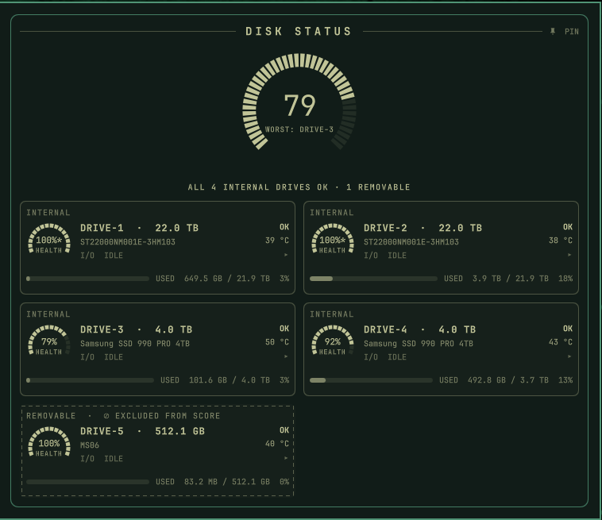
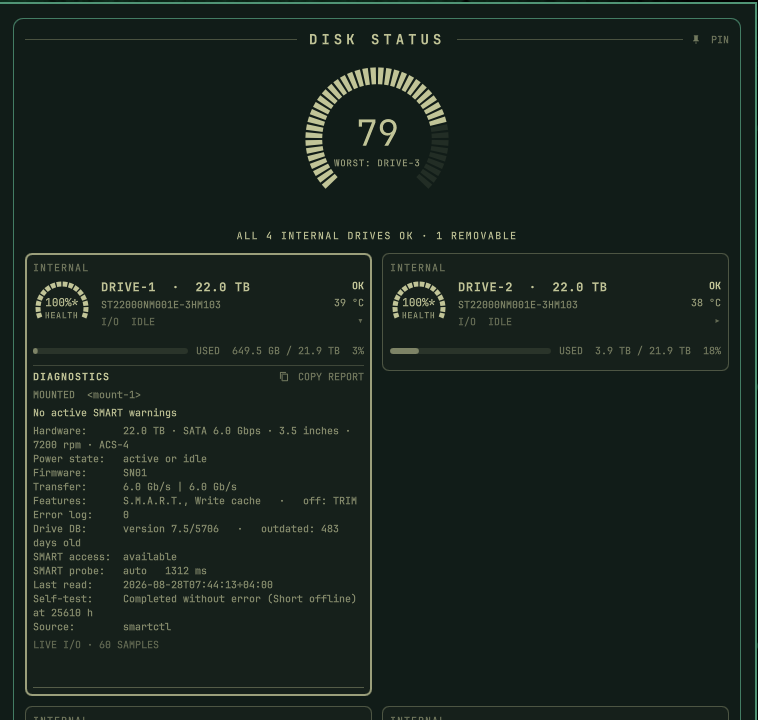
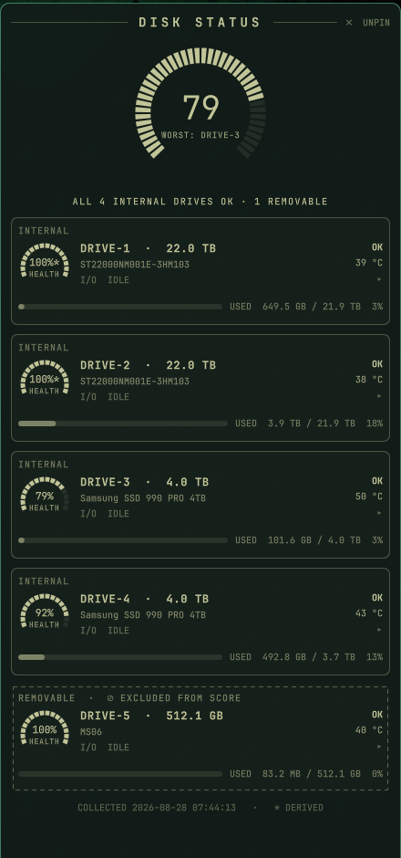

# Omarchy Disk Status

SMART status, capacity, temperature, removable-drive state, and live I/O in one lightweight Omarchy dashboard.



<details>
<summary>Expanded drive diagnostics</summary>



</details>

<details>
<summary>Persistent right-side status rail</summary>



</details>

## What it shows

- Health from SMART/NVMe evidence, with explicit `OK`, `CAUTION`, `FAIL`, or `NO DATA` states
- Storage usage calculated as `used / (used + available)`
- Temperature with drive-specific warning thresholds
- Live per-disk and aggregate I/O from `/proc/diskstats`
- Expandable diagnostics, history, and copyable support reports
- Fixed and removable disks, with removable devices excluded from the system score
- A compact popup or persistent one-column right-side rail
- Automatic Omarchy theme and font integration

Unknown or stale data never appears healthy. A full segmented health ring is reserved for exactly 100%, and derived health percentages carry `*`.

## Requirements

- Omarchy with the current Quickshell plugin system
- Python 3.11 or newer
- `smartmontools`, `util-linux`, systemd, and udev
- `libnotify` for optional desktop alerts

On Omarchy/Arch:

```bash
sudo pacman -S smartmontools util-linux libnotify
```

## Install

Add and enable the Omarchy plugin:

```bash
omarchy plugin add https://github.com/denizkin28/omarchy-disk-status --enable
```

Then install the collector and notification services from the cloned plugin:

```bash
~/.config/omarchy/plugins/denizkin.disk-status/install.sh
```

The installer adds the collector, CLI, notifier, hardened systemd units, and udev integration; preserves existing history; creates a configuration only when one does not exist; and performs the first collection.

Preview builds that used the former internal name are migrated automatically: configuration, state, and history move to the Disk Status paths before the obsolete services are removed.

Verify the result:

```bash
disk-status status
systemctl status disk-status-collect.timer
```

## Configuration

The optional configuration file is `~/.config/omarchy/disk-status.toml`. Use it for friendly drive names and notes, rated SSD endurance, classification overrides, ignored devices, and thresholds.

```toml
[names]
"EXAMPLE_SERIAL" = "archive"

[endurance]
"EXAMPLE_SERIAL" = 1200

[thresholds]
hdd_temp_warn  = 55
ssd_temp_warn  = 70
nvme_temp_warn = 70
wear_warn_pct  = 20
io_show_mbps   = 10
stale_minutes  = 45
```

The complete template is at [`config/disk-status.toml.example`](config/disk-status.toml.example). Apply changes with:

```bash
sudo systemctl start disk-status-collect.service
```

## Popup and pinned modes

Click the bar icon to open the popup. Use **PIN** for a right-side layer-shell window that reserves workspace space. Pinned mode uses one card per row; the popup uses two columns where space allows.

```bash
omarchy-shell denizkin.disk-status showPopup
omarchy-shell denizkin.disk-status hidePopup
omarchy-shell denizkin.disk-status showSidebar
omarchy-shell denizkin.disk-status hideSidebar
omarchy-shell denizkin.disk-status toggleSidebar
```

## CLI

The unprivileged CLI reads the same state as the QML interface and never runs SMART commands itself:

```bash
disk-status status --full
disk-status drives
disk-status io --watch
disk-status history SERIAL
disk-status events -n 20
```

Before sharing diagnostics, always redact them:

```bash
disk-status report --bundle disk-status-support.tar.gz --redact
disk-status report --json --redact --output report.json
```

Redaction keeps drive models and capacity/usage figures because they are useful for diagnosis. It removes hostnames, serials, WWNs, device and mount paths, notes, and identity-bearing event details.

If installation cannot reach `systemctl --user`, run it from a terminal inside your logged-in Omarchy desktop session so the user session bus is available.

## Architecture and resource use

```text
smartctl + lsblk
       │
       ▼
disk-status-collect  (root, every 30 minutes or on device change)
       │ atomic write
       ▼
/var/lib/disk-status/disk-status.json
       ├── QML bar + dashboard  (unprivileged)
       ├── disk-status CLI      (unprivileged)
       └── desktop notifier     (user service)
```

The privileged collector is a short-lived hardened systemd oneshot. The dashboard never invokes `smartctl`. Live I/O uses inexpensive kernel counters at 1 Hz while visible and 15-second intervals while closed; expanded diagnostics and sparklines are created only on demand.

## Health semantics

- The headline selects the worst eligible internal drive, not a fleet average.
- Removable drives never affect the headline or bar verdict.
- HDD percentages marked `*` are conservative derived indicators, not vendor-reported remaining life.
- A verdict may still be caution or failure when no reliable percentage exists.
- Missing or stale collector data produces `NO DATA`, never an optimistic default.

This dashboard is an early-warning interface, not a backup system or a guarantee that a drive will not fail.

## Privacy and support

Collector state can contain serials, WWNs, models, mount paths, filesystem usage, and optional notes. Do not attach raw state or SMART dumps to public issues. See [`SECURITY.md`](SECURITY.md).

## Development

```bash
omarchy plugin validate .
qmllint Panel.qml BarWidget.qml RadialGauge.qml
python -m py_compile bin/disk-status bin/disk-status-collect bin/disk-status-notify
bash -n install.sh
```

See [`CONTRIBUTING.md`](CONTRIBUTING.md). The project is licensed under the [MIT License](LICENSE).
